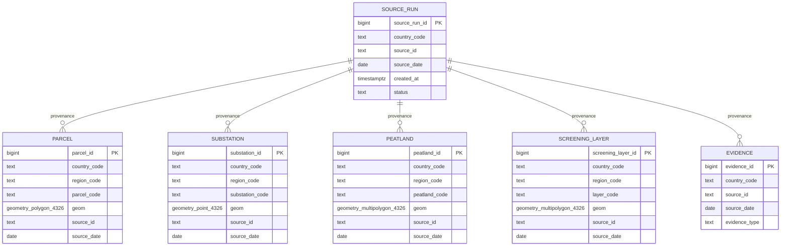

# IRIS Pilot Schema

## Schemas
- **iris_staging** — `feature_raw`: raw, country-scoped source records before promotion.
  Geometry is nullable and unconstrained (source data can be invalid); a
  `validation_status` flags rows as `pending` / `valid` / `rejected`.
- **iris_core** — validated business data. Every geometry column enforces
  EPSG:4326, non-empty, `ST_IsValid`, and coordinates within lon/lat range via
  `iris_core.is_valid_wgs84()`.

## Entity-relationship diagram

`PARCEL`, `SUBSTATION`, `PEATLAND` and `SCREENING_LAYER` each carry their own
foreign key to `SOURCE_RUN` on `(country_code, source_id, source_date)` — not
drawn as separate boxes above for clarity, but present in `004_core_tables.sql`.
`PEATLAND` and `SCREENING_LAYER` have no direct relationship to `PARCEL`; the
two pilot verticals relate them spatially (`ST_DWithin`, `ST_Intersects`), not
by foreign key.

## Keys and constraints
| Table | Natural key (country-scoped) | Notes |
|---|---|---|
| source_run | `(country_code, source_id, source_date)` | Target of every FK below |
| evidence | `(country_code, source_id, source_date, evidence_type)` | |
| parcel | `(country_code, parcel_code)` | |
| substation | `(country_code, substation_code)` | |
| peatland | `(country_code, peatland_code)` | |
| screening_layer | `(country_code, region_code, layer_code, source_date)` | Versioned by `source_date`, one geometry per layer per region per version |

`country_code` is `NOT NULL` and `CHECK (country_code ~ '^[A-Z]{2}$')` on every
table. Referencing an unknown or wrong-country `(source_id, source_date)` pair
fails the foreign key.

## CRS policy
All `iris_core` geometry is stored in **EPSG:4326 (WGS84)**. This is a storage
and interchange choice, not an accuracy claim: 4326 is what upstream sources
typically deliver, avoids an implicit re-projection during load, and every
pilot country can use the same column definition. Metric operations
(distance in `bess_candidates.sql`, area in `peatland_screening.sql`) cast to
`geography`, which computes on the spheroid rather than treating degrees as
metres. `iris_staging.feature_raw.geom` is typed `geometry(Geometry, 4326)`
(no subtype) because raw source rows may carry any geometry type.

## Indexes
- GiST on every `iris_core` geometry column, plus GiST on `geom::geography`
  for `parcel` and `substation` (an index on `geom` does not serve
  `ST_DWithin` on the geography-cast expression).
- B-tree on `(country_code, region_code)` on every business table, since
  every pilot query scopes to a country and region first.
- B-tree on `(country_code, source_id, source_date)` on every business
  table, backing both provenance lookups and the foreign key.

## Deliberate simplifications
- **No historical versioning of core rows.** A re-promoted parcel would need
  an explicit upsert policy (new row vs. update-in-place); the pilot doesn't
  have one yet.
- **No polygon/multipolygon normalization.** `parcel` is typed `Polygon`, not
  `MultiPolygon`; a source that ships multi-part parcels would need either a
  wider column type or a split step in the promotion pipeline.
- **`feature_raw` is a single table for four entity types.** Fine at pilot
  scale; production would likely split by entity type once promotion logic
  diverges.
- **No row-level security by country.** Country scoping here is enforced by
  keys and constraints, not by database roles; a multi-tenant production
  deployment would add RLS policies per country_code.
